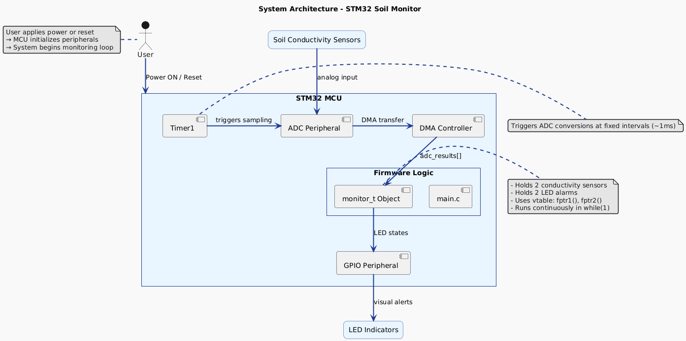

# Soil Monitor (STM32)
Conductivity-based soil moisture sensing system for smart agriculture.

## System Overview
-**Description:**[ Soil moisture monitor with local alerting. When LED 'alerts' are solid 
                   this means the soil moisture is sufficient. When the LED 'alerts' blink
                   this means the user should add water to the soil until the respective LED
                   goes from blinking to solid.]
---

## 🏗️ System Architecture

---

## 🎬 Live Demo

## 🧭 Board Information
- **Board Name:** [ STM32F030F4Px Device from STM32F0 series]
- **MCU:** [ STM32F030F4Px, ARM Cortex-M0]
- **Clock:** [48 MHz internal PLL]
- **Flash / RAM:** [e.g., 16 KB Flash, 4 KB RAM]
- **Power Source:** [e.g., USB 5V → onboard 3.3V regulator]
- **Operating Voltage:** [e.g., 3.3V logic]

---

## 🔌 Pin Mapping

| Peripheral | MCU Pin | Function / Connection | Notes |
|-------------|----------|----------------------|--------|
|LED(alert_01)| PA1      | GPIO Output          | alert_01 |
|LED(alert_02 | PA2      | GPIO Output			| alert_02 |
|LED(alert_03 | PA3      | GPIO Output          | alert_03 |
|ADC_IN7      | PA7      | ADC                  | Connected to sensor |
|ADC_IN6      | PA6      | ADC                  | Connected to sensor |
|ADC_IN5      | PA5      | ADC                  | Connected to sensor |

---

## ⚡ Power & Debug Interface
- **Power Input:** [USB external battery]
- **Programmer:** [ST-Link V2]
---

## 🧰 Toolchain Setup
| Component | Version / Tool |
|------------|----------------|
| Compiler | `arm-none-eabi-gcc` v12.2.0 |
| IDE | [ STM32CubeIDE] |
---

## 🪛 Jumpers / Configuration
- **BOOT0:** 0 (Normal boot)
- **JP1:** Closed (5V via USB)
---

