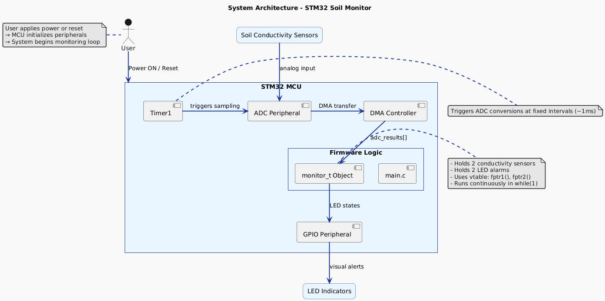

<p align="center">
  <h1 align="center">🌱 Soil Monitor</h1>
  <p align="center">Conductivity-based soil moisture sensing system for smart agriculture — built on STM32F0.</p>
</p>

<p align="center">
  
  
  
  
  
  
  
</p>

---

## 📚 Table of Contents
- [Features](#-features)
- [System Overview](#-system-overview)
- [System Architecture](#%EF%B8%8F-system-architecture)
- [Live Demo](#-live-demo)
- [Board Information](#-board-information)
- [Pin Mapping](#-pin-mapping)
- [Alert Logic](#-alert-logic)
- [Getting Started](#-getting-started)
- [Toolchain Setup](#-toolchain-setup)
- [Known Issues / Future Work](#%EF%B8%8F-known-issues--future-work)

---

## ✨ Features
- 🌿 **3-channel soil moisture sensing** via analog conductivity probes
- 💡 **LED alert system** — solid = sufficient moisture, blinking = water needed
- ⚡ **Ultra low-power MCU** (STM32F030, Cortex-M0) suitable for battery operation
- 🔋 **USB battery powered** — portable and field-deployable
- 📡 **ADC-based sensing** with no external libraries

---

## 🧭 System Overview
Soil moisture is measured across 3 independent channels using analog conductivity sensors. Each channel drives a dedicated LED alert:

- 🟢 **Solid LED** → soil moisture is sufficient
- 🔴 **Blinking LED** → soil is dry, add water until the LED goes solid

---

## 🏗️ System Architecture

<p align="center">
  
</p>

---

## 🎬 Live Demo

<p align="center">
  
</p>

---

## 🧭 Board Information
| Property          | Value                              |
|-------------------|------------------------------------|
| **Board**         | NUCLEO-F072RB                      |
| **MCU**           | STM32F030F4Px, ARM Cortex-M0       |
| **Clock**         | 48 MHz (internal PLL)              |
| **Flash / RAM**   | 16 KB Flash / 4 KB RAM             |
| **Power Source**  | USB external battery → 3.3V reg    |
| **Logic Voltage** | 3.3V                               |

---

## 🔌 Pin Mapping
| Peripheral    | MCU Pin | Function / Connection | Notes              |
|---------------|---------|-----------------------|--------------------|
| LED alert_01  | PA1     | GPIO Output           | Channel 1 alert    |
| LED alert_02  | PA2     | GPIO Output           | Channel 2 alert    |
| LED alert_03  | PA3     | GPIO Output           | Channel 3 alert    |
| ADC_IN5       | PA5     | ADC Input             | Sensor channel 1   |
| ADC_IN6       | PA6     | ADC Input             | Sensor channel 2   |
| ADC_IN7       | PA7     | ADC Input             | Sensor channel 3   |

---

## 💡 Alert Logic

| LED State    | Meaning                        | Action Required          |
|--------------|--------------------------------|--------------------------|
| 🟢 Solid     | Soil moisture is sufficient    | None                     |
| 🔴 Blinking  | Soil is dry                    | Add water until LED goes solid |

Each LED maps 1-to-1 with an ADC channel / probe, so you can monitor up to 3 separate plants or soil zones independently.

---

## 🚀 Getting Started

### Prerequisites
- STM32CubeIDE installed
- `arm-none-eabi-gcc` v12.2.0
- STM32F030F4Px board
- ST-Link V2 programmer
- Conductivity soil probes × 3

### Build & Flash
```bash
# Clone the repo
git clone https://github.com/gitFrank77/Soil_monitor.git

# Open in STM32CubeIDE
# File → Import → Existing Projects into Workspace

# Build: Project → Build All  (Ctrl+B)
# Flash: Run → Debug  (F11)
```

### Usage
1. Insert the 3 soil probes into your plant pots
2. Power the board via USB battery
3. Observe the LEDs — blinking means your plant needs water!

---

## ⚡ Power & Debug Interface
| Interface    | Details                     |
|--------------|-----------------------------|
| Power Input  | USB external battery        |
| Programmer   | ST-Link V2                  |

---

## 🧰 Toolchain Setup
| Component  | Version / Tool              |
|------------|-----------------------------|
| Compiler   | `arm-none-eabi-gcc` v12.2.0 |
| IDE        | STM32CubeIDE                |

---

## 🪛 Jumpers / Configuration
| Jumper | Setting                     |
|--------|-----------------------------|
| BOOT0  | 0 — Normal boot from Flash  |
| JP1    | Closed — 5V via USB         |

---

## ⚠️ Known Issues / Future Work
- [ ] Add UART debug output for raw ADC readings
- [ ] Configurable moisture threshold (currently hardcoded)
- [ ] Deep sleep / low-power mode to extend battery life
- [ ] Wireless reporting (BLE / LoRa) for remote monitoring

---

## 📄 License
This project is licensed under the [MIT License](LICENSE).


